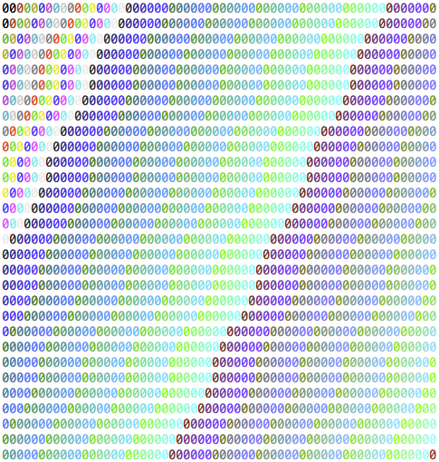

bashart
=======

bashart is a simple PHP script that produces ascii art in BASH based on mathematical expressions.

Screenshot
==========

Usage
=====

By default BASH colors are used. If your terminal does not support them a bunch of gunk will be printed to the screen.

Give the default settings a try.

    php render.php

If you see pretty colors everything is okay, otherwise you will have to switch the `$style` variable to `char`.

There are 3 basic configuration parameters at the top of the script.

    $rows = 30;
    $cols = 60;
    $style = "zerocolor";

`charcolor` prints a character based on your expression and colors it.

`zerocolor` prints 0 and colors it.

`char` just prints a character based on your expression and does not color it.

Towards the very bottom of the script you will find `printChar()` nested inside two loops. Change the first parameter to any mathematical expression you like. You have the (i, j) coordinates at your disposal. For example you may do something as simple as this.

    printChar($i + $j, $style);

You might also start a variable outside of the two loops. For example, `$c = 0;`. Then inside just before `printChar()` you may update it like this, `$c = $i + $j`. You may then use it like this.

    printChar(pow($c, 2) + $i, $style);

Your options are endless.

Have Fun /w
